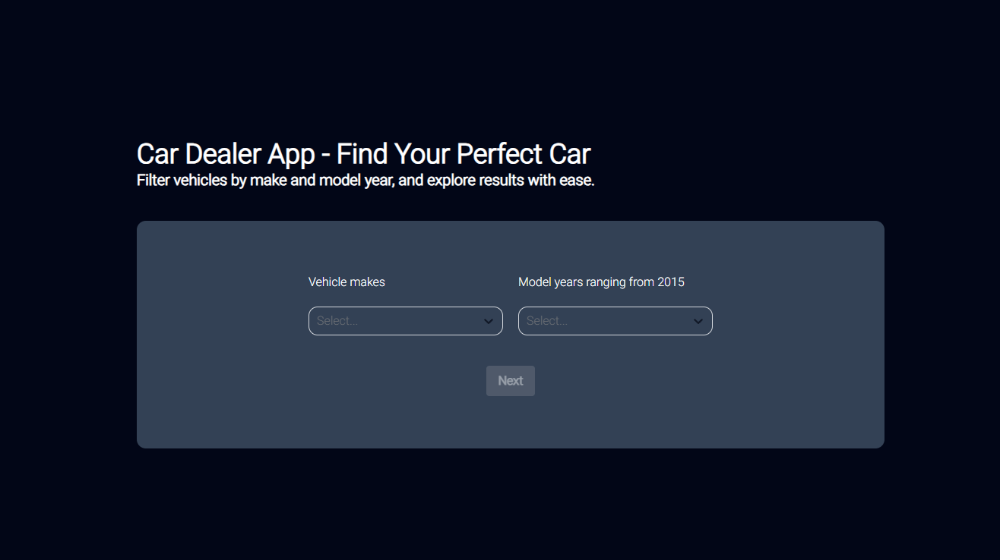

# The Car Dealear App



## 🚀 Main Functionality

- **Search for a car's model and year to see available cars with that model in just three simple steps:**
  1. **Select a model option**: Browse through all available model options and choose one.
  2. **Select a year option**: Browse through all available year options and choose one (limited to years from 2015 onwards).
  3. **Click the "Next" button**: Once both options are selected, the button to view all models from that year will become available!

## 🛠️ Technologies Used

### Frontend

- **Next.js 15.0.3:** React framework for web applications.
- **TypeScript 5:** A typed programming language.
- **Tailwind CSS 3.4.1:** A utility-first CSS framework for rapid UI design.
- **React 18:** JavaScript library for building user interfaces.
- **React Hook Form 7.53.2:** Flexible and efficient form handler for React.
- **React Select 5.8.3:** Customizable select input for React.

## 📂 Project Structure

```
swaplyar-frontend/
├── app/                     # App Router directory (Next.js 15)
│   ├── result/              # Dynamic routes to display search results
│   │   └── [makeId]/
│   │       └── [year]/      # Results page for searches by make and year
│   ├── layout.js            # Main layout of the application, includes common structure
│   └── page.js              # Project's home page
├── components/              # Reusable components
│   ├── Home/                # Component for the Home Page
│   │   └── HomePage.tsx     # Main page with filters and navigation
│   ├── Result/              # Component for the Results Page
│   │   └── ResultPage.tsx   # Results page displaying a list of cars
│   └── ui/                  # User interface components
│       ├── Container/       # Responsive container with styles
│       ├── SelectMake/      # Component for selecting car makes
│       ├── SelectYear/      # Component for selecting car years
│       └── Loading/         # Loading indicator for pending states
├── config/                  # Global project configuration
│   └── fonts/               # Custom fonts used in the project
│       └── index.ts         # Fonts setup and configuration
├── public/                  # Publicly accessible files
│   └── images/              # Project images
├── types/                   # TypeScript type definitions
│   └── data.d.ts            # Types for data used in the project
├── actions/                 # Server-side action functions
│   └── cars/                # Actions related to car data
│       └── action.cars.ts   # Function to fetch cars by make and year
├── ... other files and folders ...
└── package.json             # Project dependencies and scripts
```

## 🚀 Initial Setup

1. **Clone the Repository**

   ```bash
   git clone https://github.com/Lopezzz099/the-car-dealer-app.git
   cd the-car-dealer-app
   ```

2. **Install Dependencies**

   ```bash
   npm install
   ```

3. **Run the Project**

```bash
npm run dev
```
